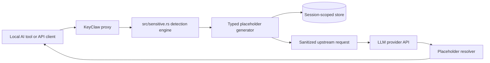

# Architecture Overview

KeyClaw is a local MITM proxy for AI developer tools. It protects live traffic by rewriting sensitive values out of outbound requests before they leave the machine, then resolving placeholders back into inbound responses before the local client sees them.

## High-Level Flow

## Request Path

1. A local client sends HTTP, HTTPS, SSE, or WebSocket traffic through the KeyClaw proxy.
2. KeyClaw checks whether the destination host is in scope for interception.
3. `src/pipeline.rs` walks JSON strings, stringified JSON, and supported base64-wrapped content.
4. `src/sensitive.rs` runs structured typed detectors plus opaque-token entropy detection.
5. Each match is rewritten to a single format-preserving placeholder such as `{{KEYCLAW_AAAA0000~o<id>}}` or `{{KEYCLAW_aaaaa@aaaaaaa.aaa~e<id>}}`.
6. The mapping is stored in a session-scoped store for later reinjection.
7. The sanitized request is forwarded upstream.

## Response Path

1. The upstream API returns a response that may contain placeholders the model repeated or transformed.
2. KeyClaw scans JSON, text, SSE chunks, and WebSocket messages for complete placeholders.
3. Matching placeholders are resolved from the session-scoped store.
4. The local client receives the resolved response with the original values restored on-device.

## Core Design Decisions

- **Single in-process engine:** KeyClaw no longer splits runtime detection across built-in rules, optional subprocess passes, and multiple storage backends.
- **Opaque typed placeholders:** placeholder IDs are session-scoped and do not leak value prefixes.
- **Session-scoped storage:** reversible mappings are kept in-memory with TTL-based eviction.
- **Fail closed by default:** if the proxy cannot safely inspect or rewrite the payload, the request is blocked instead of passed through silently.
- **Streaming-aware resolution:** SSE and WebSocket flows preserve streaming semantics instead of flattening the whole exchange into a single buffered blob.
- **Optional classifier:** the local classifier is secondary and only used to disambiguate low-confidence candidates.

## Module Map

| Module | Purpose |
|--------|---------|
| `src/sensitive.rs` | Detection engine, detector definitions, optional local classifier, and session-scoped store |
| `src/pipeline.rs` | Request rewriting and response resolution orchestration |
| `src/placeholder.rs` | Placeholder generation, parsing, and typed resolution |
| `src/redaction.rs` | JSON walking and operator/model notice injection |
| `src/hooks.rs` | Sanitized request-side hook dispatch |
| `src/audit.rs` | Structured audit logging |
| `src/stats.rs` | Audit-log summarization for CLI reporting |
| `src/proxy/http.rs` | HTTP request/response interception |
| `src/proxy/streaming.rs` | SSE placeholder resolution across chunk boundaries |
| `src/proxy/websocket.rs` | WebSocket message rewriting and response resolution |
| `src/launcher.rs` and `src/launcher/` | CLI surface, bootstrap, doctor checks, and launched-tool workflows |

## Deployment Assumptions

- KeyClaw runs on the same machine as the AI client or within the same trusted local environment.
- The client is configured to route the relevant traffic through KeyClaw.
- The client trusts the KeyClaw-generated local CA.
- The operator keeps the local machine and home directory reasonably secure.

## Related Docs

- [Configuration reference](configuration.md)
- [Supported secret patterns](secret-patterns.md)
- [Threat model](threat-model.md)
