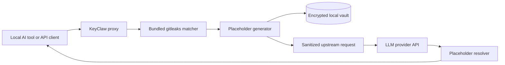

# Architecture Overview

KeyClaw is a local MITM proxy for AI developer tools. It protects live traffic by rewriting secrets out of outbound requests before they leave the machine, then resolving placeholders back into inbound responses before the local client sees them.

## High-Level Flow

## Request Path

1. A local client sends HTTP, HTTPS, SSE, or WebSocket traffic through the KeyClaw proxy.
2. KeyClaw checks whether the destination host is in scope for interception.
3. The request body is scanned with the bundled `gitleaks.toml` rules and optional entropy detection.
4. Each matched secret is replaced with a deterministic placeholder such as `{{KEYCLAW_SECRET_api_k_77dc0005c514277d}}`.
5. The secret-to-placeholder mapping is stored in an AES-GCM encrypted local vault.
6. The sanitized request is forwarded upstream.

## Response Path

1. The upstream API returns a response that may contain placeholders the model repeated or transformed.
2. KeyClaw scans JSON, text, SSE chunks, and WebSocket messages for placeholders.
3. Matching placeholders are resolved from the local vault.
4. The client receives the restored response with the real secret material reinserted locally.

## Core Design Decisions

- **Transparent proxying:** KeyClaw works at the traffic layer, so it can protect clients without requiring wrapper SDKs.
- **Deterministic placeholders:** the same secret maps to the same placeholder ID, which makes round-tripping stable.
- **Encrypted local storage:** placeholder mappings are stored in a machine-local AES-GCM vault with atomic writes.
- **Fail closed by default:** if the proxy cannot safely inspect or rewrite the payload, the request is blocked instead of passed through silently.
- **Streaming-aware resolution:** SSE and WebSocket flows are handled without flattening the stream into a single buffered blob.

## Module Map

| Module | Purpose |
|--------|---------|
| `src/gitleaks_rules.rs` | Loads and compiles the bundled gitleaks rules |
| `src/pipeline.rs` | Orchestrates request rewriting and response resolution |
| `src/placeholder.rs` | Creates, parses, and resolves placeholder identifiers |
| `src/redaction.rs` | Walks JSON payloads and injects operator/model notices |
| `src/vault.rs` | Stores secret mappings in an encrypted local vault |
| `src/proxy/http.rs` | Handles HTTP request/response interception |
| `src/proxy/streaming.rs` | Resolves placeholders across SSE stream chunks |
| `src/proxy/websocket.rs` | Handles WebSocket message redaction and resolution |
| `src/launcher.rs` and `src/launcher/` | Exposes the CLI surface and operating workflows |

## Deployment Assumptions

- KeyClaw runs on the same machine as the AI client or within the same trusted local environment.
- The client is configured to route the relevant traffic through KeyClaw.
- The client trusts the KeyClaw-generated local CA.
- The operator keeps the local machine and home directory reasonably secure.

## Related Docs

- [Configuration reference](configuration.md)
- [Supported secret patterns](secret-patterns.md)
- [Threat model](threat-model.md)
